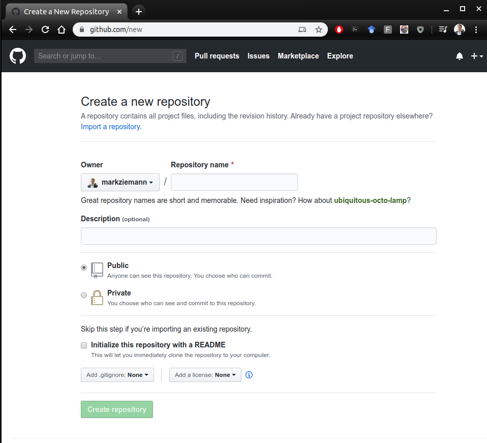
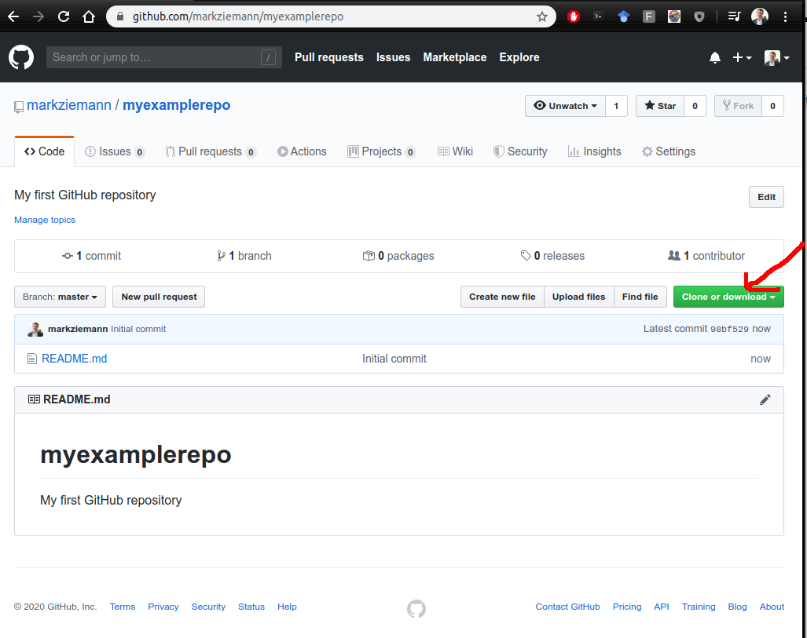
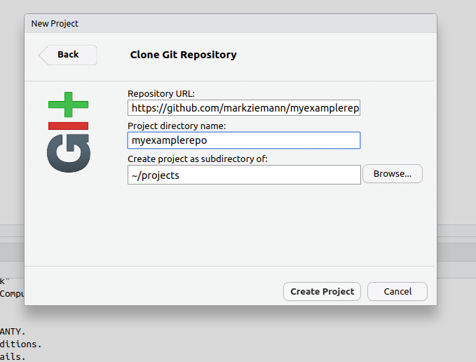
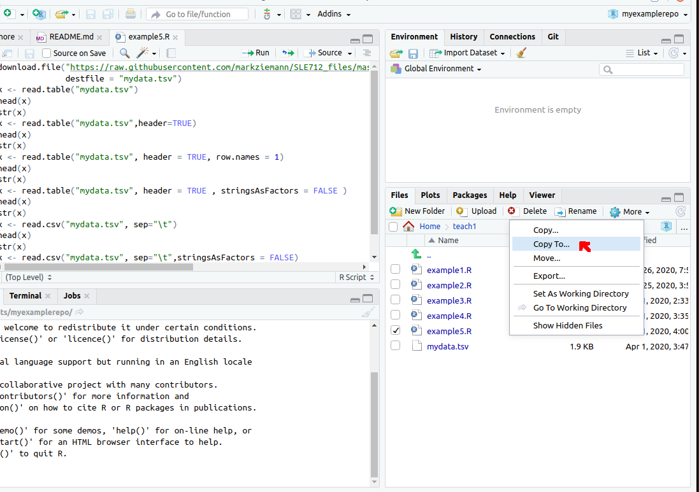
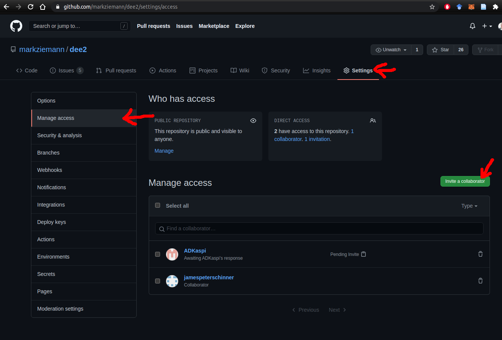
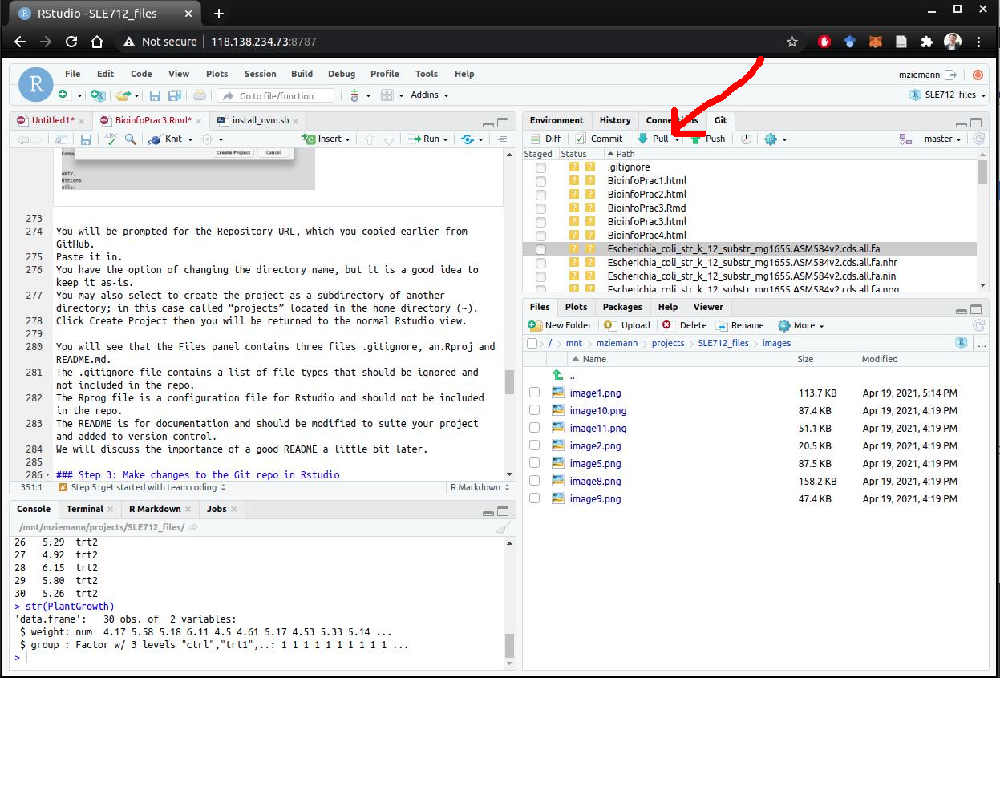

Source: https://github.com/markziemann/SLE712_files/blob/master/BioinfoPrac3.Rmd

## Introduction to Rmarkdown

Previously we have been learning about how to use R to do basic numerical analysis, work with data tables and generate charts.
In this session we will learn about two very important concepts that will take your Rstudio skills to the next level; Rmarkdown and version control.

An Rmarkdown notebook file is a combination of text, code and outputs, which when executed generates a document that looks like a report and is a great way to share your work with others. 
The benefits of using an Rmarkdown notebook are:

1. **The analysis is transparent and reproducible.**
The analysis steps (code) are shown in the report which means that the reader can get a good idea about what steps were done. 
This helps with auditing, in case inconsistencies arise.
The report should be able to be reproduced perfectly by another researcher on another system so long as the software versions are consistent.
The outputs of the analysis, including charts and tables are included in line after the corresponding code, so you can see which code chunk generated each output.
This is in sharp contrast to previous approaches, which involved R scripts that generated many outputs and it was not clear which lines of code generated which output.

2. **There is sufficient space to explain to the reader all the background details.**
For each chunk of code you use, you can write descriptions of any size to introduce concepts, explain rationale and discuss the results of analysis.
This is much better than including come comments into the code using hashes `#`
This explanatory text can also incorporated into the version control system so it enjoys all the benefits including backups and collaboration (more on that later).

3. **The Rmarkdown report is versatile.**
The source file (.Rmd suffix) can be modified in Rstudio and with the version control system (eg: GitHub).
The Rmd can be used to generate a bunch of different outputs from simple analysis reports, essays, draft journal articles, and even books and theses!
In case you need to make some modifications to the analysis (for example by changing some parameters), it is relatively easy to regenerate the report after making these modifications in Rstudio.
Contrast this to creating a word doc and then copy/pasting tables and charts everytime some modifications are made.
The format can be changed by altering the document theme.
There are themes for different types of documents like lab reports, marketing materials, books, etc.
Individual Rmd notebooks that represent chapters in a thesis can be "bound" into a full book.
The file format is HTML by default, and this allows the report to be viewed on differnt types of devices as a webpage, but it can also be generated as a PDF or DOCX.

With that out of the way, now it is time to describe what an Rmarkdown file actually is.
It is a text document with a .Rmd suffix and contains three components:

1. Header

2. Free text

3. Code chunk and outputs

While there is just one header at the top of the Rmd, there are no limits to the size and number of free text and code chunk sections.
You can literally have thousands of free text sections each with thousands of words.
Similarly, you can have thousands of code chunks, each with thousands of lines of code.
The only limitation is the execution time and the computing power available, so it is possible to make really large reports.
Although it is possible to make really large reports thousands of pages long, it is best practise to keep them as short as possible.
For example if the dataset contains 1000 lines of records, you wouldn't want to show all of them in the report because that would take up dozens of pages.
Rather it is best practice just to show a summary of the data with `head(mydata)` or `str(mydata)` which should only take up a few lines.

Have a look at an example.


So now let's dig into the structure of an Rmd file a bit more.

### Headers

The header tells Rstudio how the report should look.
it contains, author, date and output information.
Here is a minimal header example:

```
---
title: "Read in mydata.tsv"
author: "Jane Smith"
output: html_document
theme: cosmo
---
```

Here is an actual header that I have previously used ([link](https://github.com/markziemann/de_compare/blob/main/deg_compare.Rmd)):

```
---
title: "Compare DEG tools"
author: "Mark Ziemann"
date: "`r Sys.Date()`"
output:
  html_document:
    toc: true
theme: cosmo
---
```

Notice that you can specify additional options to get a report that contains a table of contents (TOC).
The TOC is hyperlinked, so you can jump to other parts of the report with a mouse-click.

After the header, you're free to add free text and code chunks.

### Free text

The name "Rmarkdown" comes from the merging of "markdown" and R scripts.
Markdown is a lightweight markup language that allows us to create webpages and other documents from an extremely simple set of rules, as you can read at the [Wikipedia link](https://en.wikipedia.org/wiki/Markdown).
The overall goal of markdown is that the source file is simple to read/edit and can be easily converted to HTML in a web browser.
The most important parts of markdown for Rstudio users are Headers and free text, which are described in the Wikipedia page above and also in the [Markdown cheatsheet](https://github.com/adam-p/markdown-here/wiki/Markdown-Cheatsheet) which I will not duplicate here.
Briefly, using markdown you can format text with bold, italics, strikethrough, use block quotes, numbered lists, bullet lists, insert images and diagrams, videos, tables and many other features.

In Rmarkdown, it is good practice to have one sentence per line.
One important thing to know is that if you want to have a line break (new paragraph), you will need to leave an empty line between sentences, otherwise they will appear in the same paragraph.


I've even used Rmarkdown to write essays for my own assessments in the units that I'm enrolled in.
These PDFs that you are downloading from the unit site were also completely written in Rmarkdown.
I find Markdown better than MS Word because Markdown has fewer ways that the text formatting can go wrong.
In a way, MS Word is more flexible, but that means it's more work to keep everything consistent throughout a long document like a journal article or thesis.
Also it isn't possible to maintain an MS Word document with version control, unlike markdown.

Using Markdown based text, you can break up your report into sections with headings, include an introduction to describe all the background information the reader will need, describe the rationale of the analysis, interpret the results of the analysis and provide some conclusions.

### Code chunks

Code chunks are special markdown elements that allow for lines of code to be executed. 
A code chunk begins with a chunk header that looks like this: '\`\`\`{r}', followed by some lines of code, followed by a chunk footer on a new like that looks like '\`\`\`'.

Here is what a chunk looks like (except that the `\` don't belong there):

```
\```{r, mychunk1}

summary(cars)

plot(mtcars$`wt`,mtcars$`mpg`,xlab="weight",ylab="mpg",main="mtcars")

\```
```

You can see that this chunk has some information in the header.

Firstly, there is an `r` which tells Rstudio that the code should be executed with R.
Interestingly Rstudio also allows execution of chunks with unix shell (`sh`), `python` and other languages, which makes it very flexible.

Other information provided includes the name `mychunk1` which is an optional, arbitrary user-defined name which allows the user to give each chunk a unique name to aid the debugging process.

When this chunk is executed it will look like this:

```{r, mychunk1}

summary(cars)

plot(mtcars$`wt`,mtcars$`mpg`,xlab="weight",ylab="mpg",main="mtcars",col="blue")

```

Isn't that cool!

One thing I would recommend is adding the option `fig.height=7` and `fig.width=7` to get a nice square-shaped chart.
So the chunk header would look like this:

\```{r, mychunk1, fig.height=7, fig.width=7}


### Test your skills

Now it is your turn to give it a try.

1. Create an Rmd document to analyse the built-in `PlantGrowth` dataset.
The data contains measurements of control (ctrl) and treated (trt1, trt2) samples.
In the Rmd you need to calculate the numerical mean, median and interquartile ranges of the three groups of samples, and plot these as a boxplot.
Use the `head()` and `str()` commands to get a better idea of the structure of the dataset.

2. Create a second Rmd document to analyse the built-in `cars` dataset.
The data contains distance and speed measures of 50 cars.
Make a plot of the speed (x-axis) against the distance (y-axis) and provide a trend line and Pearson correlation coeficient.

1 and 2 above should be completed in two separate Rmd files called "plantgrowth.Rmd" and "cars.Rmd". 
Make sure the header is properly formed.
A single space out of place can cause the format to get broken.
Use headings like "Introduction", "Results" and "Conclusion" to provide structure to your report.

Include a chunk at the very end of each Rmd file that executes the `sessionInfo()` command.
We do this so that the reader can see what version of R was used along with all the loaded package versions.
In theory, the report is 100% reproducible if the software versions are consistent (unless some element of randomness was used).

Finally, run "knit" for both your Rmd files to ensure that there are no errors and that they are generating the desired output.

That's all for this first section.
We will discuss your solutions to these two questions during the workshop.
In the second part, we will discuss version control which is a system to keep track of all the changes that have happened to a codebase over time. 

## Introduction to version control

Version control helps teams of developers and analysts keep track of the changes to the scripts and software over time. 
All modifications to files and scripts are recorded, so that they can be reverted in case a mistake was made. 
Using a cloud based git client like GitHub or BitBucket gives you the added benefit of backing up the code in case you lose your laptop or server fails. 
GitHub and similar clients are great in allowing teams around the world to contribute to a project in parallel. 
In bioinformatics, version control with GitHub or BitBucket is considered industry best practices for providing open-source software to the computational biology community. 
When you modify the code relating to a project, it is important to commit and push the changes. 
When actively working on a project you should commit and push at least once per day.
GitHub is one of the main ways that bioinformaticians, and researchers in general share their code.
It allows other researchers to download and reproduce their work. 
There are many benefits to version control, whether you’re working solo or as part of a large team.
Let’s have a look at what the experts say [here](https://stackoverflow.com/questions/1408450/why-should-i-use-version-control).

In this practical, you will learn how to integrate version control into your Rstudio workflow, and make the most of the features available in GitHub.
To prepare for this session, you should create an account with GitHub and note your username and password (you will need this later).
You will also learn how to document a GitHub repository with a README.md and provide comments to your code. 

### What is a repository?

In order to use version control for your project, you will need to put the files in a repository.
A repository is just a fancy word for a special folder that contains files whose changes need to be recorded over time.
For a software project these files are normally different bits of code, but it can also include some other types of data.
In some bioinformatics projects you might want to include a samplesheet.
Just be sure that the data is non-identfiable if it is a human study.
It is important to note that large data files including raw sequencing data should not be included in a Github repository because these large files will make everything slower.
Those large files belong in other data repositories such as the institutional research data store or public ones like Zenodo or NCBI.

There are actually two type of repository, the "local" one which is managed by Rstudio and the "remote" which is managed by Github.
This distinction is important for understanding how Github works.

In order to learn a bit more about repositories, why don't you explore the SLE712 repository [here](https://github.com/markziemann/SLE712_files).
This repository is where I like to manage the bioinformatics related content for this unit.
Click on the commit history to see how the repository has changed over time.

### Step 0: tell Rstudio/git who you are

In order to get git working with Rstudio, we need to tell git who you are.
In the bottom left panel, click the "Terminal" tab and enter in the following commands, substituting your own Github alias and email.

```
git config --global user.name "John Doe"
git config --global user.email johndoe@example.com
```

### Step 1: Start a new repository for your Rmd

Source [(Jenny Bryan 2020)](https://github.com/jennybc/happy-git-with-r).

In this part we are going to create a GitHub repository starting at `github.com`, so you will need to register for a username and password and then get logged in.

Click the green "New repository" button. Or, if you are on your own profile page, click on "Repositories", then click the green "New" button.

You will get the following image:



Here's how to fill this in:

* Repository name: myrepo (or whatever you wish).

* Description: "My first GitHub repo" (or whatever, but some text is a good idea).

* Public: Yes.

* Initialize this repository with a README: Yes.

* For everything else, just accept the default.

Then click the big green button "Create repository".
Congrats, you have created your first GitHub Repo!

You will see a new screen, Click on the green “Clone or Download” button and copy the HTTPS address for the repo.



### Step 2: Start a new repository for your Rmd

The next step is to connect your Rstudio to the GitHub repo.

In Rstudio, start a new project by clicking on File > New Project then clicking on Version Control then Git.
You will see a pop-up that looks like this:


You will be prompted for the Repository URL, which you copied earlier from GitHub.
Paste it in.
You have the option of changing the directory name, but it is a good idea to keep it as-is.
You may also select to create the project as a subdirectory of another directory; in this case called “projects” located in the home directory (~). 
Click Create Project then you will be returned to the normal Rstudio view. 

You will see that the Files panel contains three files .gitignore, an.Rproj and README.md. 
The .gitignore file contains a list of file types that should be ignored and not included in the repo.
The Rprog file is a configuration file for Rstudio and should not be included in the repo.
The README is for documentation and should be modified to suite your project and added to version control.
We will discuss the importance of a good README a little bit later.

### Step 3: Make changes to the Git repo in Rstudio

To demonstrate the process of contributing to a repo, we will begin by copying an Rmd from the "Test your skills" section of this document script above. 

In the Files panel, locate the "plantgrowth.Rmd" and "cars.Rmd" you made. 
It will most likely be in your home directory.
In order to copy the file, tick the box next to the file name and click the More button then it will show the "Copy to…" option.
Next, select the Destination location as the project folder that you created in Step 2, then click the Save button.
Here is a screenshot to help you find the "Copy to" button:


Before including these two files in the new GitHub repo it is a good idea to "knit" them, which will check that the document as a whole is free of errors and generates the desired output.
If there are errors, fix them and repeat the knit process until all errors are resolved.

Then, in the upper right panel, click the "Git" tab and you should see "plantgrowth.Rmd" and "cars.Rmd" in the list of files.
Click the boxes beside these files marked "staged". 
This will mark these files to be included in the repository.
Next, click the "Commit" button in the Git tab.
This will open a pop-up.
Type in a commit message which is related to the motivation for the change in the repo.
An example could be "added new Rmd files for class activity"
Once you have commited the files, these changes will be finalised for the "local" repo, but won't change the "remote".
To change the remote repo, you will need to click the "push" button.
In order for these changes to be made, you will need to enter your username and password.

If everything goes according to plan, then when you visit your repo at github.com you will see that the changes have taken effect.

### Step 4: Writing a good README

In this next part, you will create a descriptive README file.
The README is the documentation that users will read first.
There are no definite rules for what a README must contain, but I have set up this set of minimum 
It needs to contain the following:

* The purpose of the repo.

* A list of contents and their purpose.

Furthermore it is recommended you have:

* Instructions for how to use the scripts/software.

* Contributors: names of the people who contributed.

* How people can raise issues or get help.

Before you write your own README, take a look at some popular templates [here](https://github.com/sfbrigade/data-science-wg/blob/master/dswg_project_resources/Project-README-template.md) and [here](https://github.com/equinor/data-science-template/blob/master/README.md).

Your job now is to write a brief README for your new GitHub repo.
You should do this within Rstudio, then stage, commit and push the changes as you did before.

### Step 5: get started with team coding

While some smaller projects are done solo, the trend nowadays is for impportant research software projects to involve many contributors.
For your assignment, you will need to create a new repository and add your partner as a collaborator.
That way you will both have access to push changes to the repo on the main branch.
Follow the three arrows in the image below to invite a collaborator.
You will need their Github alias or email address to identify them.



Once invited, the invitee will need to check their email and confirm the invite.
Once confirmed, they will have the ability to push changes.

A word of warning though, you will need to sync your local repo with remote everytime you begin working on the code, because your collaborators might have made recent changes that you do not have.
To do this, you will need to run a git "Pull".



If you don't pull, then you will get errors when you want to finally push your work.
There will be merge conflicts and a lot of frustration, so please always pull when you work on a project at the start of the day.
You will also need to run a pull if anyone has made modification to the remote repo if they have used the GitHub.com webpage to make changes.

### Step 6: learn about branches

For a short and relatively simple project such as assessment task 3, you will only need one branch called "main".
That's why we will not be spending class time discussing or working on branches.
Still, it is important that you are aware that other projects need to have more than one branch; indeed there may be questions about branches on the exam.

As an example, businesses need to ensure that their "main" branch is working properly at all times and they need extensive testing of any new changes before they are incorporated into main.
For each new feature they might have a new separate branch which contains the special changes required to enable this new feature.
By keeping these changes in a separate branch, they can ensure that "main" is stable, and any new bugs that are discovered do not cause any downtime to the business services.

In a bioinformatics project you might use branches if you are working on your own R package which is already used by hundreds of people around the world.
If you want to create a new feature, it would be best to make these changes in a development branch where you can perform extensive development and testing without breaking the main branch. 
After passing all tests, you can then "merge" the development branch with the main to enable those new features for the hundreds of users.


### Final thoughts

If anything goes wrong and things get broken somehow, the beauty of version control is that you can revert to earlier version because all earlier versions are saved.

### Try it yourself

Did you manage to commit and push the two Rmd files and customise your README?
If so, well done!
If not, note down the steps where things went wrong.
Save a screenshot of where you got stuck and record any error messages.
Post this info in the discussion board and I will try to diagnose it.
Otherwise we will have time to discuss these issues in the workshop time.

## Session information

For reproducibility.

```{r,sessioninfo}

sessionInfo()

```