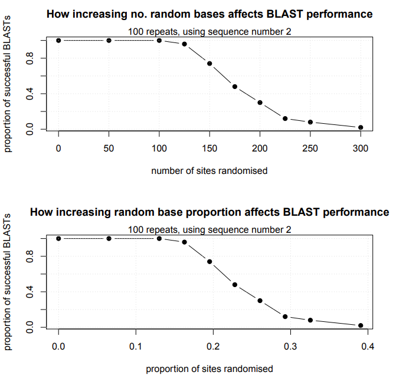

Source: https://github.com/markziemann/SLE712_files/blob/master/BioinfoPrac5.Rmd

## Introduction

In this practical we will use all the foundational skills we have been developing over the past four sessions to solve a bioinformatics based problem.

One of the key skills in bioinformatics is the ability to pickup and use tools developed by others.
Today we will be using BLAST.
You may have used it before in an internet browser, but today we will be learning how to run large scale analyses within R.
The fundamental skills you learn in this practical will not just allow you to complete the assessment, but provide you with the basis to learn and apply many bioinformatics tools.

BLAST is short for Basic Local Alignment Search Tool.
As the name suggests, it is a search tool which allows us to query a database of many sequences with one or a few sequence of interest [(Camacho et al. 2009)](https://bmcbioinformatics.biomedcentral.com/articles/10.1186/1471-2105-10-421).

MAFFT is a global alignment tool that we will also be using.
It is suited to comparing a few sequences with one another.
It is faster than other tools like CLUSTALW [(Katoh and Standley 2013)](https://academic.oup.com/mbe/article/30/4/772/1073398).

In this prac we will be learning how to run BLAST searches and create multiple sequence alignments within R. 

We will be working with Zika virus sequences.
It is important to become familiar with the genomic features of this virus.
It has a linear single-stranded, 10 kilobase, positive-sense RNA genome.
The genome encodes 10 proteins that are cleaved from a single peptide strand. 

Here are some useful resources for Zika genomic information:

* [NCBI Information](https://www.ncbi.nlm.nih.gov/Taxonomy/Browser/wwwtax.cgi?lvl=0&id=64320)

* [Journal article from Ayres et al, 2019](https://parasitesandvectors.biomedcentral.com/articles/10.1186/s13071-019-3461-4)

## Hypothetical situation

You are part of a public health team that has visited rural villages in Northern Brazil involved in surveillance of Zika virus.
You have identified a village in the State of Maranhao with a high positivity rate and the health authorities have asked your team to perform genome sequencing to understand whether there are any mutations that could be associated with higher infectivity.

## Prerequisite libraries and sources

There are some packages that we will need to get things working.

* `seqinr` is a package designed to process and analyse sequence data.

* `R.utils` provides the ability to extract compressed files.

* We will need an R interface to run BLAST searches called `rBLAST`.

* `ape` provides clustal alignment capability and `adegenet` converts sequence data between major formats.

* In addition, we will "source" two functions which I have prepared earlier.

```{r,libs}

suppressPackageStartupMessages({
  library("seqinr")
  library("magrittr")
  library("kableExtra")
  library("R.utils")
  library("rBLAST")
  library("ape")
  library("ORFik")
  library("Biostrings")
  source("https://raw.githubusercontent.com/markziemann/SLE712_files/master/assessment_task3/bioinfo_asst3_part2_files/mutblast_functions.R")
})

```

## Download the Zika genome sequences

A batch of 16 genome sequences were downloaded from the [NCBI Virus](https://www.ncbi.nlm.nih.gov/nuccore) using a search consisting of `txid64320[Organism:exp] AND "complete genome" `on the 3rd May 2021.
We will call these the reference isolates.
These have been uploaded to a webserver and can be accessed by this [link](http://ziemann-lab.net/public/SLE712/).

```{r,seq_db_dl}

download.file("http://ziemann-lab.net/public/SLE712/Zika_sequences.fasta",
              destfile = "Zika_sequences.fasta")

# create the blast DB
makeblastdb("Zika_sequences.fasta",dbtype="nucl", "-parse_seqids")

```

## Download novel genome sequence

Your sequencing lab have just completed sequencing and uploaded the fasta file [here](http://ziemann-lab.net/public/SLE712/NewSequence.fasta).

```{r,novelseq_dl}

download.file("http://ziemann-lab.net/public/SLE712/NewSequence.fasta",
              destfile = "NewSequence.fasta")

SEQ <- seqinr::read.fasta("NewSequence.fasta") 

str(SEQ)

SEQ <- SEQ[[1]]

SEQ[1:50]

str(SEQ)

# get sequence length and calculate the GC content
seqinr::getLength(SEQ)

seqinr::GC(SEQ)

```

## A function to run a BLASTN search

We previously sourced a function that ran blast searches in R.
This function is required because blastn is a unix shell tool.
You don't need to know exactly how it works, just that you will also need it for assessment 3.
The function requires two inputs (1) the query sequence (R object) and (2) the database (system file).
The output is a table of BLAST results.

```{r,myblastn_tab}

myblastn_tab

```

## BLAST Search for Zika genomes with the highest similarity to the novel sequence

One of the first things we can do is to compare the novel sequence against the set of known Zika genomes.
This may provide clues as to the origin of this isolate.

```{r,blast1}

res <- myblastn_tab(myseq = SEQ, db = "Zika_sequences.fasta")

# have a look at the BLAST results
str(res)

# it is important here to store the sseqid because we will need it
# later to determine whether BLAST matches the gene of origin
kbl(res) %>% kable_paper("hover", full_width = F)

top_hits <- as.character(res$sseqid[1:3]) 

top_hits

```

Go to https://www.ncbi.nlm.nih.gov/nuccore and search the three top hits.
Do these related isolates originate from areas close to the State of Maranhao?

## Run a multiple sequence alignment of the novel sequence with the top hits 

Now that we know which of the taxa are most similar to the novel strain, we can see how different the sequences are to one another with a multiple sequence alignment using MAFFT.
We can select to generate a tree in Newick format.

```{r,curate_seqs}

myseqs <- NULL

db <- read.fasta("Zika_sequences.fasta")

str(db[1:6])

head(names(db))

# extract the genbank accession from the name
names(db) <- sapply(strsplit(names(db),"\\|"),"[[",4)

# extract the names of the top hits
myseqs <- db[which(names(db) %in% top_hits)] 

str(myseqs)

# add the novel sequence to the multisequence object
SEQL <- list("NovelSeq"=SEQ)
myseqs <- c(myseqs,SEQL)

str(myseqs)

# Write out to a file
seqinr::write.fasta(myseqs,names=names(myseqs),file.out = "myseqs.fa")

```

Now run the bash shell command.
Notice how it's possible to "hide" the output if it is too big.

```{bash,mafft,results="hide"}

mafft --auto --clustalout --treeout myseqs.fa 

```

## Tree generation

Next we can use the tree viewing ability of the `ape` package. 

The length of the branch indicates the degree of sequence divergence.

```{r,treeplot}

# read in the file as a single string
treetext <- paste(readLines("myseqs.fa.tree"),collapse = " ")
treetext

tree <- ape::read.tree(text=treetext)
str(tree)
ape::plot.phylo(tree,type = "phylogram", use.edge.length = TRUE)

```


## In detail comparison of SEQ and the top BLAST hit

We can run a BLASTN to create a pairwise alignment to identify the main differences between SOTS and the top hit.

```{r,detailed_comparison}

tophit <- db[which(names(db) %in% top_hits[1])] # extract the names of the top hit

str(tophit)

seqinr::write.fasta(tophit,names=names(tophit),file.out = "tophit.fa")

makeblastdb("tophit.fa",dbtype="nucl", "-parse_seqids")

res <- myblastn(myseq = SEQ, db = "tophit.fa")

cat(res,fill=TRUE)

```

## Predict protein sequences

Open reading frames begin with a start codon AUG and end with a stop codon (UAA,UAG,UGA).
We will be using `BioStrings`, `ORFik` and `GenomicRanges`.

```{r,orfs}

# read the fasta file
newseq <- readDNAStringSet("NewSequence.fasta")

# find the coordinates of the ORFs
newseq_orf <- ORFik::findORFs(newseq,startCodon = "ATG", minimumLength = 100)

# sort the ORFs by location
newseq_orf <- GenomicRanges::sort(newseq_orf)

# Now the same for the tophit
tophit <- readDNAStringSet("tophit.fa")
tophit_orf <- ORFik::findORFs(tophit,startCodon = "ATG", minimumLength = 100)
tophit_orf <- GenomicRanges::sort(tophit_orf)

newseq_orf
tophit_orf

# now extract the sequences with the approach
# DNAStringSet(newseq,start, end)
mystart = start(newseq_orf)[[1]][1]
myend = end(newseq_orf)[[1]][1]
newseq_orf1 <- DNAStringSet(newseq,start = mystart, end = myend)
newseq_orf1_aa <- Biostrings::translate(newseq_orf1)

mystart <- tophit_orf@unlistData@start
myend <- mystart + tophit_orf@unlistData@width
tophit_orf1 <- DNAStringSet(tophit,start = mystart, end = myend)
tophit_orf1_aa <- Biostrings::translate(tophit_orf1)

Biostrings::writeXStringSet(c(newseq_orf1_aa,tophit_orf1_aa), filepath = "aa_sequences.fasta", append=FALSE,
                compress=FALSE, compression_level=NA, format="fasta" )

```

## Pairwise alignment of protein sequences

Let's take a look at the protein sequence differences using `BioStrings`.

```{r,proteinalignment}

# this way we can compare the 1st sequence of each list
aln <- Biostrings::pairwiseAlignment(tophit_orf1_aa,newseq_orf1_aa)

# percent identity
pid(aln)

# Provide overview of differences
summary(aln)

# character string mashup
compareStrings(aln)

```

Now generate protein alignment with MAFFT

```{bash,aa_aln}

mafft --auto --clustalout --treeout  aa_sequences.fasta

```

# More functions required for Assessment Task 3

The assessment task 3 part 2 requires you to randomise some nucleotide positions into your sequence of interest and see whether BLAST can still correctly match the original sequence.
We can imagine that the larger N is, the similarity between the mutated sequence and the original sequence drops, and so the probablility (P) of a BLAST match drops.
To be able to mutate a sequence, you can use the following function.

## The mutator function

It randomly replaces a number of DNA bases with a random base.
This is not strictly related to the hypothetical scenario but will be useful to complete the assessment.

```{r,mutator}

mutator

```

## Let's give this a try with an example

Here we createt he mutated sequence

```{r,mutator_example}

# read in
tophit <- seqinr::read.fasta("tophit.fa")

# remove list structure
tophit <- tophit[[1]]
str(tophit)

# too long. just get first 400 bp
tophit <- tophit[1:400]

# mutate
tophit_mut <- mutator(myseq=tophit,nmut = 100)

tophit_mut

```

## Confirm changed bases

Using simple string comparison.

```{r,}

tophit == tophit_mut

which(tophit == tophit_mut)

length(which(tophit == tophit_mut))

length(which(tophit != tophit_mut))

```

Now we can perform pairwise alignment to prove that the mutation has worked as expected.

```{r,mutator_example2}

# Convert to biostring
tophit_f <- DNAString(c2s(tophit))
tophit_mut_f <- DNAString(c2s(tophit_mut))

aln <- Biostrings::pairwiseAlignment(tophit_f,tophit_mut_f)

pid(aln)

nmismatch(aln)

summary(aln)

```

# Testing the limits of BLAST

After adding some mismatches to tophit, we can check whether BLAST is still able to recognise the gene of origin.

```{r,testblast}

# first need to write the blast index
makeblastdb(file="tophit.fa",dbtype = "nucl")

# test with 20 mismatches
tophit_mut <- mutator(myseq=tophit, nmut = 20)
res <- myblastn_tab(myseq = tophit_mut, db = "tophit.fa")
res

# test with 50 mismatches
tophit_mut <- mutator(myseq=tophit, nmut = 50)
res <- myblastn_tab(myseq = tophit_mut, db = "tophit.fa")
res

# test with 80 mismatches
tophit_mut <- mutator(myseq=tophit, nmut = 80)
res <- myblastn_tab(myseq = tophit_mut, db = "tophit.fa")
res

!is.null(res)

```

The complication is that if we repeat the test with NMUT=80 multiple times, the result is not consistent. 
Sometimes the BLAST finds the match and sometimes not.
That means it is necessary to repeat (replicate) the test many times to get an average value.

Below we create a wrapper function that allows us to repeat the test as many times as we like with a set value of mutations (NMUT).


```{r,testblast2}

rep_mut <- function(NMUT) {
  tophit_mut <- mutator(myseq=tophit, nmut = NMUT)
  res <- myblastn_tab(myseq = tophit_mut, db = "tophit.fa")
  as.numeric(!is.null(res))
}
  
replicate(n = 10, rep_mut(80))

```
Do you think 10 replications is enough?
How do you choose a good number of replications?

You can also scan multiple values of NMUT using `sapply` or `lapply`. 

```{r,testblast3}

n_mut_range <- c(30,60,90)

replicator_function <- function(NMUT){
  mean(replicate(n = 10, rep_mut(NMUT)))
}

myresult <- sapply(n_mut_range, replicator_function)

myresult

```

Last challenge is to create a chart which demonstrates the number of sites randomised (x) by the proportion of successful BLASTS (y).
I will leave this exercise to you, given that we learned about scatterplots and line diagrams in our first two sessions.

Here is an example of a chart which could be used:




## References

(References managed by [BibGuru](https://www.bibguru.com/).)

Ayres, C. F. J. et al. (2019) “Zika virus detection, isolation and genome sequencing through Culicidae sampling during the epidemic in Vitória, Espírito Santo, Brazil,” Parasites & vectors, 12(1), p. 220.

Camacho, C. et al. (2009) “BLAST+: architecture and applications,” BMC bioinformatics, 10, p. 421.

Katoh, K. and Standley, D. M. (2013) “MAFFT multiple sequence alignment software version 7: improvements in performance and usability,” Molecular biology and evolution, 30(4), pp. 772–780.

## Session info

```{r,sessioninfo}

sessionInfo()

```
